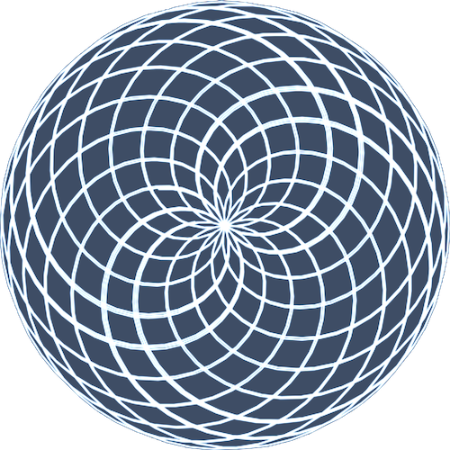

  

<h1 align="center">Irrational Pi Algorithm Art</h1>

## Credit & Inspiration

I want to give full credit for this project to **[@fascinating.fractals](https://www.youtube.com/@fascinating.fractals)** and his [video](https://www.youtube.com/shorts/aUDYWYqtAR4) about drawing irrational Pi. It was thanks to his code in the YouTube video's description and his explanation that I was able to [Vibe Code](https://en.wikipedia.org/wiki/Vibe_coding) this project. Credit also goes to [Cursor IDE](https://www.cursor.com/), which was the main tool used to Vibe Code this project.

## About

This is a project, created through [Vibe Coding](https://en.wikipedia.org/wiki/Vibe_coding), that visualizes the irrational nature of Pi by using a double-arm [algorithmic system](https://en.wikipedia.org/wiki/Algorithmic_art). The interactive visualization draws beautiful patterns using the relationship between rotational speeds tied to Pi and customizable drawing parameters. Users can experiment with various controls to generate unique artistic interpretations of Pi's irrationality. After seeing the video and realizing that the code was not available, I had to try to recreate it.

## Preview

  

## Features

- Interactive parameter controls via a customizable panel
- Options to pause, reset, randomize, clear, or save both settings and imagery
- Pixel preservation mode for high-density trail art
- Load and save your favorite settings as JSON
- Download canvas art with one click
- Each session offers a different way to visually experience Pi

## How to Use

1. Open `index.html` directly in your browser.
2. Use the ⚙️ icon to toggle the controls panel.
3. Adjust sliders or numeric inputs for speed, arm lengths, trail length, arm skip, or line width.
4. Use buttons to pause or play, reset, randomize, clear, or save the current visualization or settings.
5. Flip Pixel Mode on or off for alternative rendering.
6. Save your settings as JSON or load previously saved settings.
7. Download your art when you find a pattern you enjoy.

## How It Was Built

1. For a quick overview: This project was built using [Cursor IDE](https://www.cursor.com/), [Claude App](https://claude.ai/chats), [ChatGPT App](https://chat.openai.com/chat), [Cha](https://github.com/MehmetMHY/cha/), and [Gemini App](https://gemini.google.com/app). The models `Claude 3.7 Sonnet`, `Google Gemini 2.5 Pro`, and `OpenAI o3` were used in most of these tools.

2. I used [Cha](https://github.com/MehmetMHY/cha/) to extract the content and description from **@fascinating.fractals**' [video](https://www.youtube.com/shorts/aUDYWYqtAR4).

3. The content was input as a prompt into [Claude App](https://claude.ai/chats) to generate a prototype and render it in their **Interactive Artifact** side window. Claude's **Claude 3.7 Sonnet** was used for this entire process.

4. After the prototype was good enough and I ran out of free chat memory, I created a local [git](https://git-scm.com/) project and transferred the code from Claude's web app to this local git project.

5. After transferring it, I opened the local project with **Cursor IDE**, where I have a Pro plan, and used **Claude 3.7 Sonnet** and **Google Gemini 2.5 Pro** to finish implementing the project. I also used the **ChatGPT** and **Gemini** web apps to generate ideas, which I then fed into **Cursor IDE** to fix more complex bugs. In **ChatGPT**, I used OpenAI's **o3** model, and in **Gemini**, I used their **Google Gemini 2.5 Pro** model.

6. I tested the project in my browser by just opening the single `index.html` file.

7. The logo/favicon was created by taking a screenshot of one of the images the app generated, cropping it, removing the background pixels, adjusting the color values, and reducing the image resolution using macOS's [Preview](<https://en.wikipedia.org/wiki/Preview_(macOS)>) app.

8. Finally, I created the `.gitignore` file, set up the git project's directory structure, created a [GitHub](https://github.com/) repo, and pushed everything from my local git project to that GitHub repo. I formatted the entire codebase using [fm](https://github.com/MehmetMHY/fm), and I wrote the `README.md` myself. However, I used [Cha](https://github.com/MehmetMHY/cha/) to help me draft and polish the `README.md`. With all of that, the project was complete. From time to time, I still open [Cursor IDE](https://www.cursor.com/) and use the same models to fix any errors I find, but the project was essentially complete at that point.

## License

This project is licensed under the [GNU General Public License v3.0](./LICENSE). Major creative credit goes to **[@fascinating.fractals](https://www.youtube.com/shorts/aUDYWYqtAR4)** for the algorithmic inspiration.
